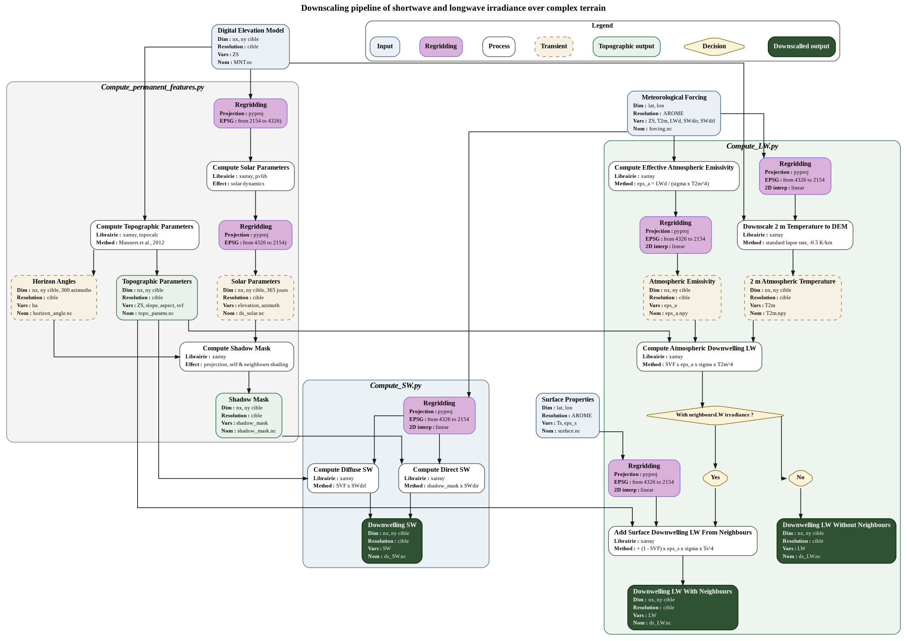
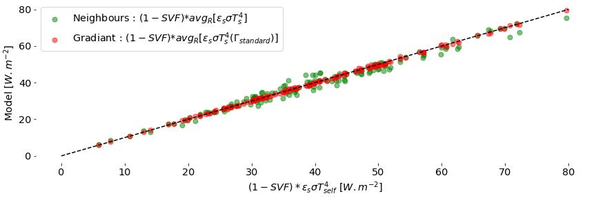

::::: titlepage
::: center
\
**Improving Complex terrAin RadIatiOn**\
ICARIO\

{width="85%"}

L. Barrois$^{1,2}$, I. Gouttevin$^{1,2}$, N. Villefranque$^{2,3}$

$^{1}$Centre d'Etude la Neige, Météo France\
$^{2}$Centre National de Recherche Météorologiques, France\
$^{3}$Laboratoire Plasma et Conversion d'Energie, CNRS, France Date\
:::

::: center
{width="2.5cm"}
{width="6cm"}
:::
:::::

# Glossaire

Pour faire apparaître la biblio : [@aubry2018importance]

# On the scientific context of solar and thermal radiation in complexe terrain

- Différents phénomènes physiques et propriétés radiatives atm & surface

- **Texte de justification descente d'échelle EDELWEISS**

- Manquement de la littérature sur le LW

- Accent mis sur l'apport des méthodes MC pour le rayonnement

# Long wave irradiance downscalling baseline method for EDELWEISS

- Context EDELWEISS

- Méthode choisie

  <figure id="fig:flowchart" data-latex-placement="H">
  
  <figcaption aria-hidden="true"></figcaption>
  </figure>

- Justification méthode choisie en faisant référence à la première
  section

- Méthode d'interrogation des voisins

  <figure id="fig:neighbour_method" data-latex-placement="H">
  
  <figcaption aria-hidden="true"></figcaption>
  </figure>

- Résultat et comparaison

# On the contribution of Monte Carlo methods to the study of thermal radiation

- Présentation de la méthode

  <figure id="fig:schema_MC" data-latex-placement="H">
  
  <figcaption aria-hidden="true"></figcaption>
  </figure>

- Présentation des simulations

- Présentations des conditions atmosphériques/surface

  <figure id="fig:profiles_atm" data-latex-placement="H">
  
 

  <figcaption>Temperature and molar fraction of water vapour profiles for
  the various standard atmospheres (a), absorption coefficient <em>k</em><em>a</em> profiles for
  thermal wavelengths for Mid Latitude Summer ATMosphere
  (SMLSATM).</figcaption>
  </figure>

- Méthode d'analyse : catégorie de chemins

## On the effects of the spectral correlations

- Epaisseur de peau atmosphérique

- Fenêtre atmosphérique

- Conséquence sur les flux

<figure id="fig:skin_length" data-latex-placement="H">

<figcaption>Number of emission by different atmospherique iso-altitude
layers reaching a given surface element ordered by wavelength for the
standard Mid Latitude Summer ATMosphere (SMLSATM).</figcaption>
</figure>

<figure id="fig:atm_alt_layers_flux" data-latex-placement="H">

<figcaption>Downwelling thermal radiative flux by different
atmospherique iso-altitude layers reaching a given surface element
ordered by wavelength for the standard Mid Latitude Summer (SMLSATM) and
Winter (SMLWATM) ATMospheres .</figcaption>
</figure>

- Echantillonnage spectrale de la surface

<figure id="fig:lambda_filter" data-latex-placement="H">

<figcaption>Number of emission by the surface reaching a given surface
element ordered by wavelength for the standard Mid Latitude Summer
(SMLSATM), Mid Latitude Winter (SMLWATM) and transparent (EMPTATM)
ATMospheres.</figcaption>
</figure>

- Conséquences en terme d'écart au rayonnement du corps noir pour le
  terme surface-surface

<figure id="fig:CN_vs_MC" data-latex-placement="H">

<figcaption>Comparison of the downward thermal flux estimates accounting
for uniforme (grey atmopshere) or standard (symbolic assumption)
spectral correlations for 100 surface elements randomly distributed in
and around the Clot Chatel valley, Ecrins, French Alps.</figcaption>
</figure>

## On the impacts of the complex topography

- Distribution complexe sur une distribution de propriétés radiatives &
  température déjà complex

<figure id="fig:distrib_topo" data-latex-placement="H">

<figcaption>Distribution of emission events across the surface for a
surface element (blue star) in the Ecrins, French Alps. Standard
altitudinal surface lapse rate of −6.5<em>e</em>−3 <em>K</em>.<em>m</em>−1</figcaption>
</figure>

# Results

## Statistics by category

<figure id="fig:basique_stats" data-latex-placement="H">

  

<figcaption>Statistics by category (space, atmosphere, surface) of
emission events for 100 surface elements randomly distributed in the
Ecrins, French Alps.</figcaption>
</figure>

## Impact of the lapse-rate gradient on the downwelling long wave flux

<figure id="fig:T_lapse_rate_effect" data-latex-placement="H">

<figcaption>Downwelling thermal fluxes calculated by htrdr for a set 100
surface elements randomly distributed in the Chartreuse, French Alps,
for a TROpical standard (STROATM) and a uniforme grey (TUXUATM)
ATMosphere.</figcaption>
</figure>

## Occluding atmosphere effect

<figure id="fig:fake_topo" data-latex-placement="H">

<figcaption>Représentation non exhaustive de profiles topographiques des
DEM idéalisés.</figcaption>
</figure>

<figure id="fig:fake_flux_svf" data-latex-placement="H">

<figcaption><em>S</em><em>V</em><em>F</em><em>h</em><em>t</em><em>r</em><em>d</em><em>r</em>
et composante atmosphérique de la densité de flux LW pour une caméra
fixe dans des topographies idéalisée changeante, invariante de <em>S</em><em>V</em><em>F</em><em>D</em>&amp;<em>F</em>.</figcaption>
</figure>

## A first model

<figure id="fig:simple_model" data-latex-placement="H">

<figcaption>Comparison between the downwelling thermal flux calculated
by htrdr and simple models for various standard atmospheres, for 100
surface elements randomly distributed in the Ecrins, French
Alps.</figcaption>
</figure>

- Comment exprimer un $A_{tm}VF$ à partir de l'humidité à 2 mètre, i.e.
  une modélisation de l'émissivité basé sur des variables à 2 mètre\...
  ?

# Perspectives

- Nouvelle version de htrdr pour une analyse quantitative globalisée

- Introduction d'atmosphère non standard (nuages, aérosols\...)

# Annexes

## Number of trajectories sensibility

<figure id="fig:sensibility_n_chemin" data-latex-placement="H">

<figcaption>Comparison of downwelling thermal surface fluxes for
different number of trajectories between htrdr and a simple
model.</figcaption>
</figure>

## Dispersion of temperature distribution sensibility

<figure id="fig:sensibility_lapse_rate" data-latex-placement="H">

<figcaption>Comparison of downwelling thermal surface fluxes for
different surface temperature altitudinal lapse rates between htrdr and
a simple model.</figcaption>
</figure>

## Distributed surface radiative properties
